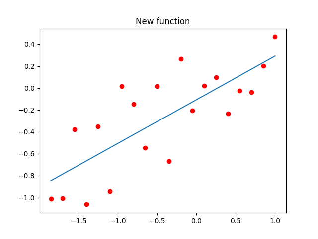

# Лабораторная работа №5
# Двумерный поиск для подбора коэффициентов простейшей нейронной сети на примере решения задачи линейной регрессии экспериментальных данных

# Задание (вариант №6)

В зависимости от варианта работы найти линейную регрессию функции
(коэффициенты наиболее подходящей прямой) по набору ее дискретных значений,
заданных равномерно на интервале со случайными ошибками. Выполнить расчет
параметров градиентным методом. Провести двумерный пассивный поиск оптимальных
весовых коэффициентов нейронной сети (НС) регрессии.

| c   | d   | a   | b   | N   | A   |
|-----|-----|-----|-----|-----|-----|
|0.5  |0    | -2  |  1  | 20  |  1  |

## Выполнение лабораторной работы

Исходный код программы приведён в файлах [approximator.py](approximator.py) и [main.py](main.py)

Результат работы программы приведён ниже.

